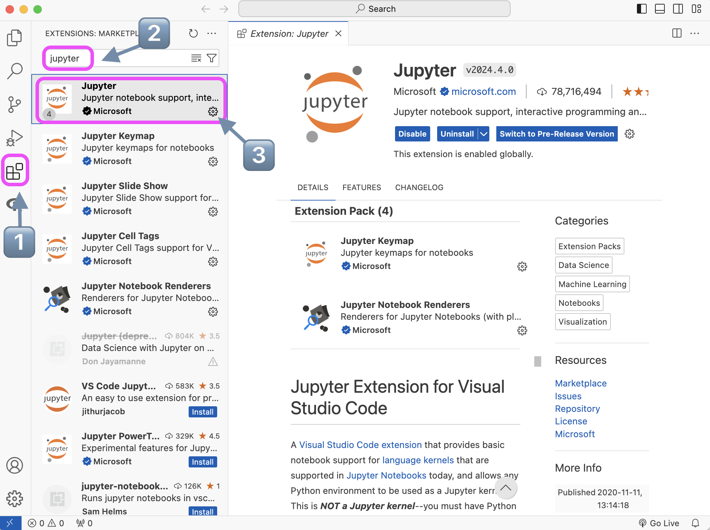
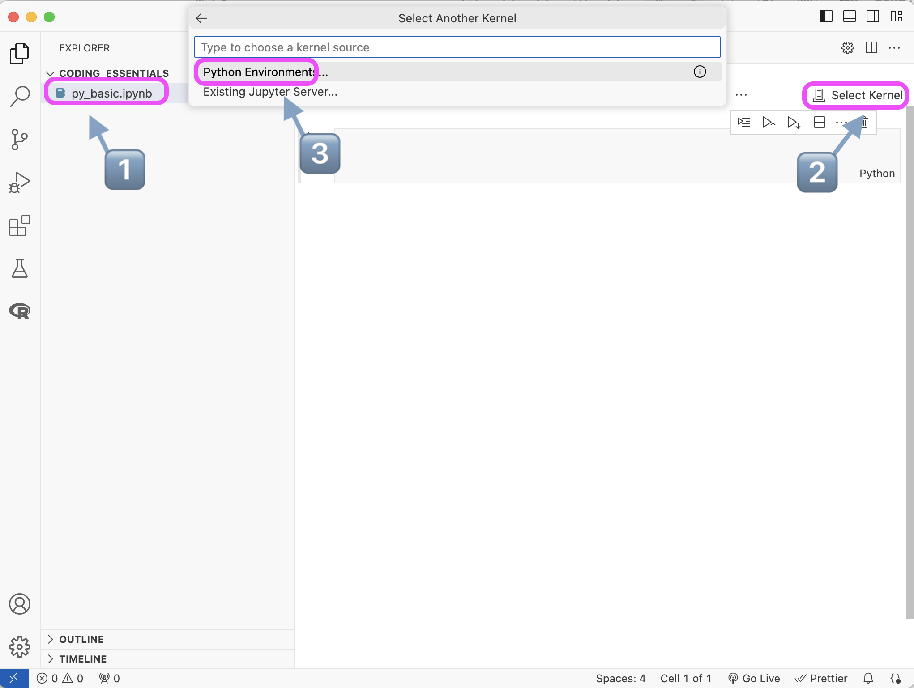

In this post, we are going to install Python, look at the ten Python data types, and write a few lines of very simple Python code. You may need to use Terminal in some cases, but I won't touch the details about shell scripts here.

## Installation

Python is free and open-source, and installing Python is extremely easy: just go to the [official website](https://www.python.org/downloads/), click the yellow "Download Python _version number_" button, double click the .pkg you download, and click continue a lot of times–just as installing any other softwares.

After installation, you also need an editor to write code. My current most frequantly used editor is Visual Studio Code, or VS Code, which has multiple selection, powerful find and replace, and smart folding and unfolding. With the versitile extension marketplace, I even write Stata code in it, since the Stata do file editor cannot fold easily with tabs, and thus bad for long do files. For more VS Code tricks, you can look at their offical [user guide](https://code.visualstudio.com/docs/editor/codebasics), or just search whatever you think in Google!

Installing VS Code is also extremely easy: Just go to its [official website](https://code.visualstudio.com) and you can find the blue "Download" button on the left and top right. Then follow the instruction, you will have it installed on your computer.

Personally, I think Jupyter Notebook is a good place to start coding, as you can get the output for each code block, which is very helpful to see what change have your code made. To use Jupyter Notebook in VS Code, just click the "L-tetromino" shape button on the left, then search "jupyter" in the search bar, and finally click "install" to get Jupyter Notebook inside VS Code.

    
    <em style="display: block; margin-top: 5px;">As I have already installed, there is no "install" button here.</em>

_Side note: you can also use Jupyter Notebook directly on your computer and use it in your web browser. You may need to use Terminal and pip to install it. Please see [official instructions](https://jupyter.org/install) for more information. Since JupyterLab is the newer version of the notebook, if you want to download it, I would recommend you to start directly from JupyterLab instead of Jupyter Notebook._

Finally is the last step before actually coding: create a new Jupyter Notebook with your preferable file name and .ipynb extension, then click "select kernal," and then select a Python environment. If this is the first time for you to use python, then there will be only one global environment here. Select that, and we are ready to start!

_Side note: environment management is also very important in the later stage as you start to use different packages. As there may be conflicts between packages, it is important to separate them. I will introduce more on this topic in part 6._

##
