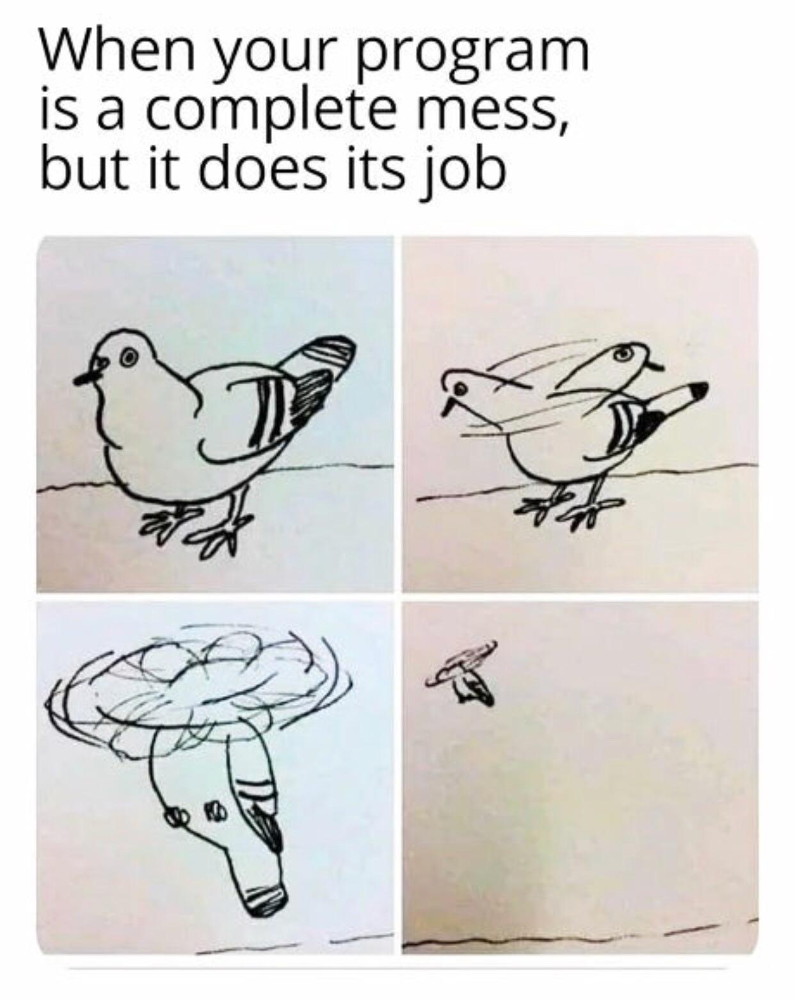

As I'm leaving my current position in mid-July, my supervisor asked me to create a brief tutorial for my successor. This tutorial could include things that are frequently used in my work or that I wished I had learned before I started. I was a little hesitant about this at first since all of the skills are quite task-specific, and the only thing I have consistently used is Google. Sometimes, I feel like I am too curious about too many things, so I may waste a lot of time looking for a one-time solution. Additionally, learning new things is the most fun part of the job. If I share too much, am I depriving my successor of the fun part of the job?

I soon felt reconciled to this. If there is too much to learn, then the fun part will never be depleted. Although I'm worried the skills are task-specific, there is some overlap, and I have always used what I learned more than once. It's still hard to say what I wish I had learned before I started, but I can share what I learned on the job.

Therefore, this series of posts is structured as follows:

**Part 0**: This article, which serves as a table of contents.

**Part 1**: Python introduction, including Python installation, my preference for code editors, ten Python data types, condition syntax (if-else statements), for and while loops, and functions.

**Part 2**: Data cleaning with Stata and Python, including importing files, generating new variables, changing variable values, regular expressions, reshaping datasets, combining datasets, and saving datasets in both Stata and Python.

**Part 3**: OCR with Python, including preprocessing images to make them more easily recognized by the models, and using Tesseract or Textract to perform OCR.

**Part 4**: Web scraping with Python, including using Beautiful Soup to get information from .html files and using Selenium to navigate around webpages.

**Part 5**: Data analysis in Stata, including regressions, exporting regression results, and making plots.

**Part 6**: A little on shell scripting, including basic shell knowledge, how to manage python environments, and how to access the server.

As I am not a computer science major, the intuitions in my posts may not be accurate, and the solutions may not be the most efficient ones. I will try my best to make them accurate and welcome any suggestions and comments through email (unfortunately, my blog does not have a comment system yet, but hopefully, I will add one soon!). You can contact me using the "@" button on the homepage and under my name at the beginning of this post. I will also update the posts as I expand my knowledge on related topics. Additionally, as I'm a Mac user, everything in this series will be related to the macOS system, although it should be fairly easy to find the Windows/Linux syntax once you know what to look for!

Next up, it's time for some inspirational talk.

- It's very important to try things out when it comes to coding. If you are uncertain about whether something will work or not, just put it through Python, and it will give you an answer–the worst-case scenario is only seeing some errors, not a big deal :cowboy_hat_face:

- It is also very common to face some errors and not know how to start a new task. But please remember, you are not the only one who has faced such challenges. Many others have faced them already, so you can always find solutions online.

- Don't worry if your code looks weird. The only thing you need is to make it work.

    
    <em style="display: block; margin-top: 5px;">As long as it works!</em>

  Hope you enjoy!
  

